# Ponderada M9 Semana 1
Rafael Techio

## Sobre o TDD

O TDD é uma metodologia de desenvolvimento muito útil que além de trazer confiabilidade ao sistema, muitas vezes exige uma melhor organização de código. É possível definir um clico de TDD composto de três partes:

### Red

 A primeira etapa do TDD é a construção de testes que falharão.  Isso ocorre pois primeiro definimos o resultado esperado e a ação que a função executará, antes de  definir sua implementação.

 ### Green

 A segunda etapa é a implementação da lógica das funções testadas até que passem nos cenários de teste. Dessa forma, garantimos que o código está executando da forma que gostaríamos, mesmo que não com a melhor implementação.

 ### Refactor

 A terceira etapa é a refatoração, onde os ajustes de implementação devem ser realizados a fim de melhorar qualidade de código, performance, convenções etc. Isso pode gerar erros nos testes, que devem ser corrigidos. Dessa forma ocorre o ciclo de TDD.

## Resultado de testes:

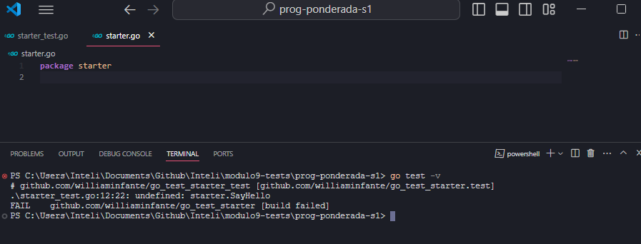

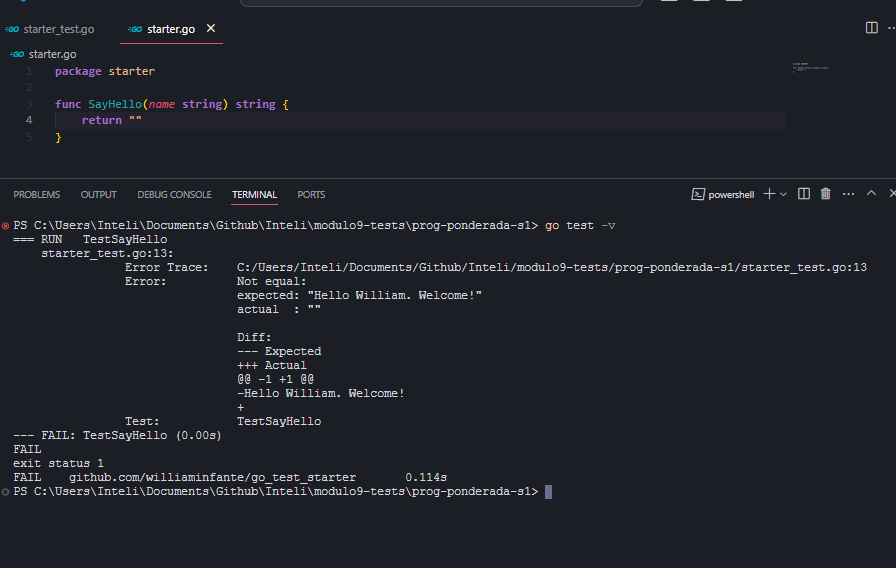

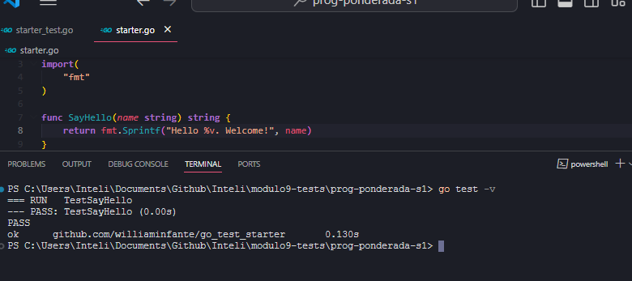

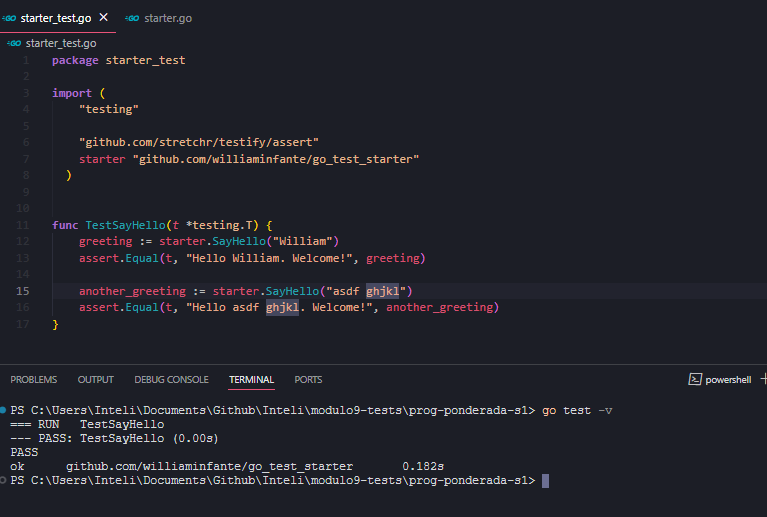

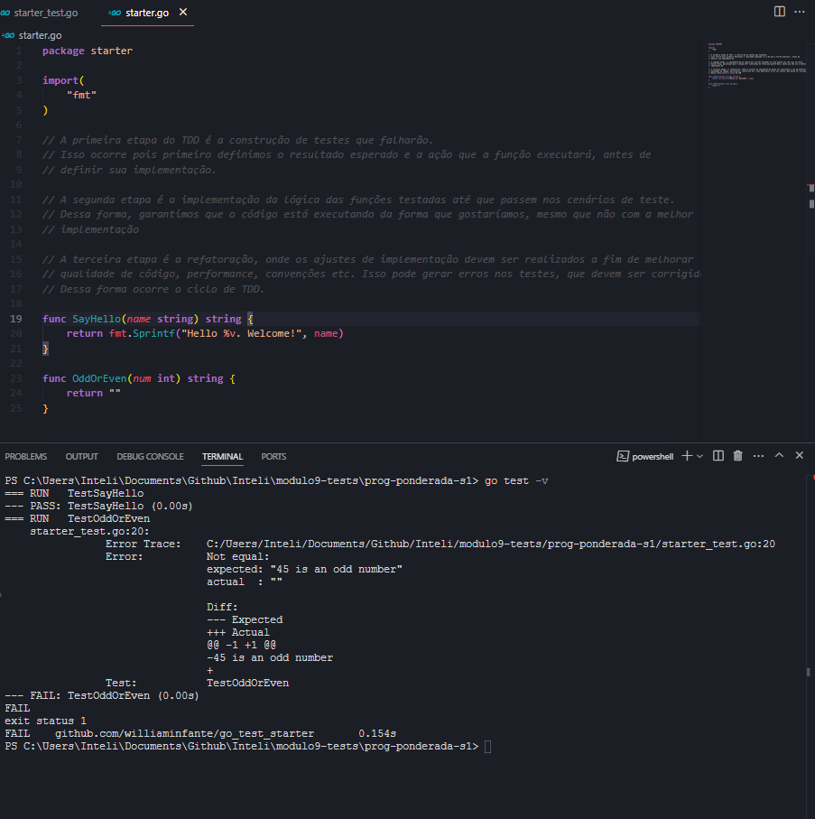

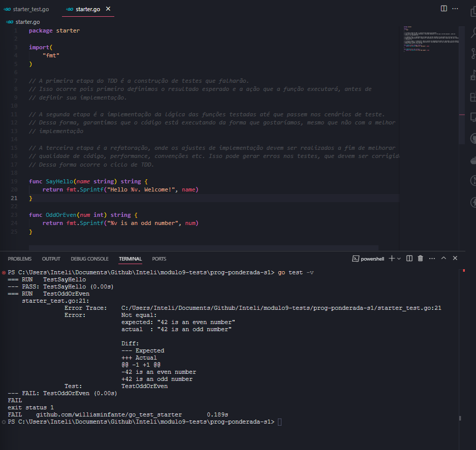

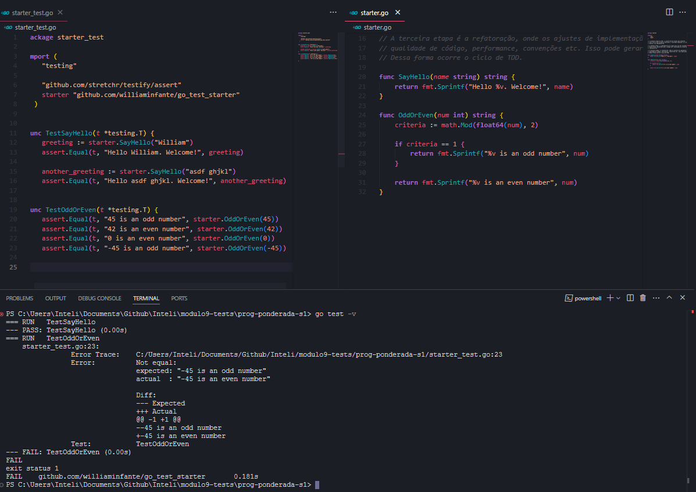

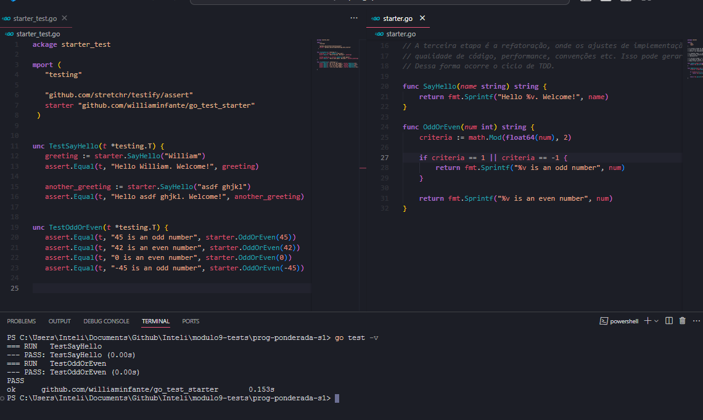

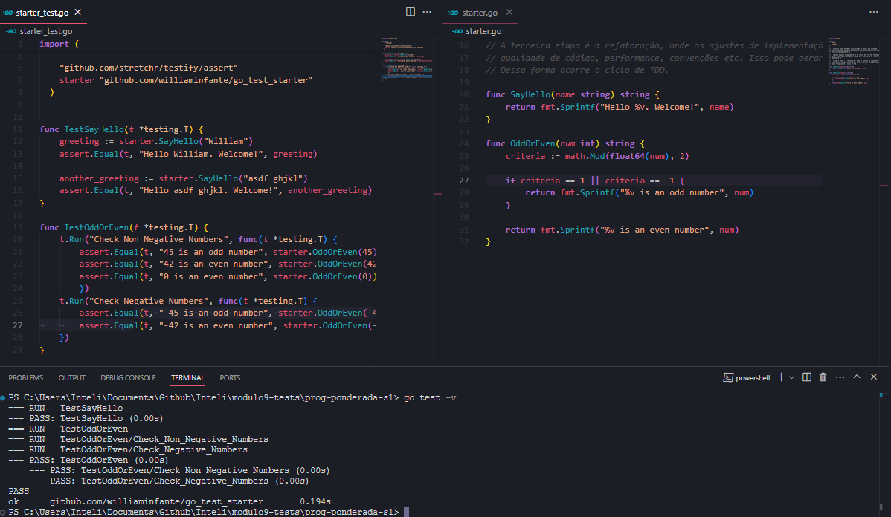

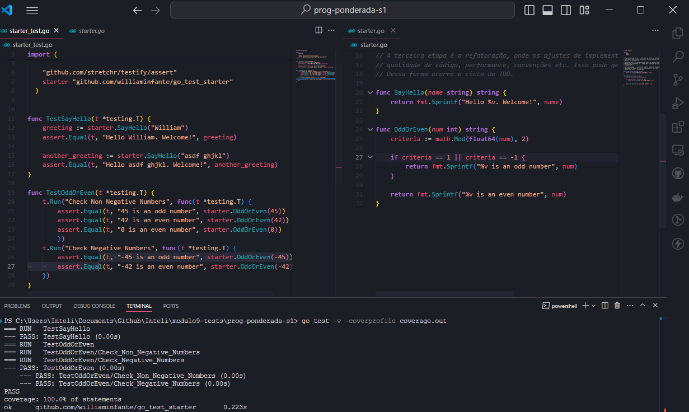

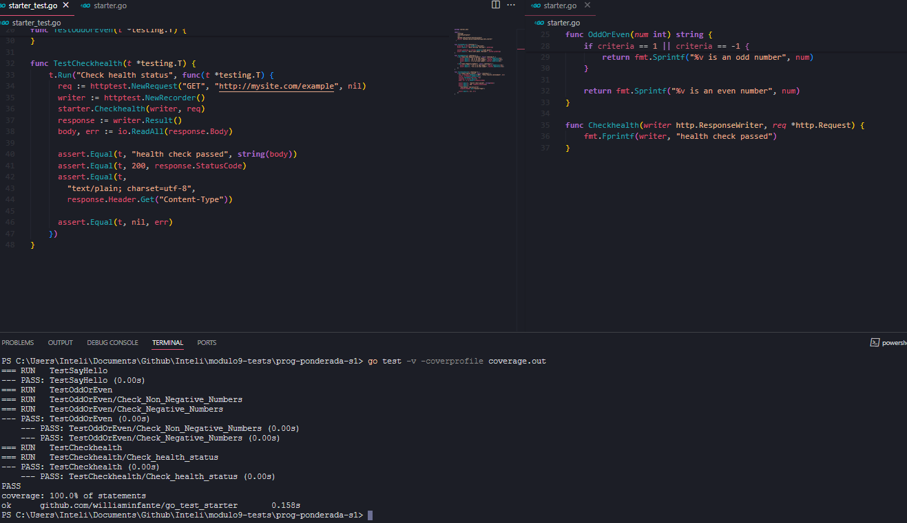